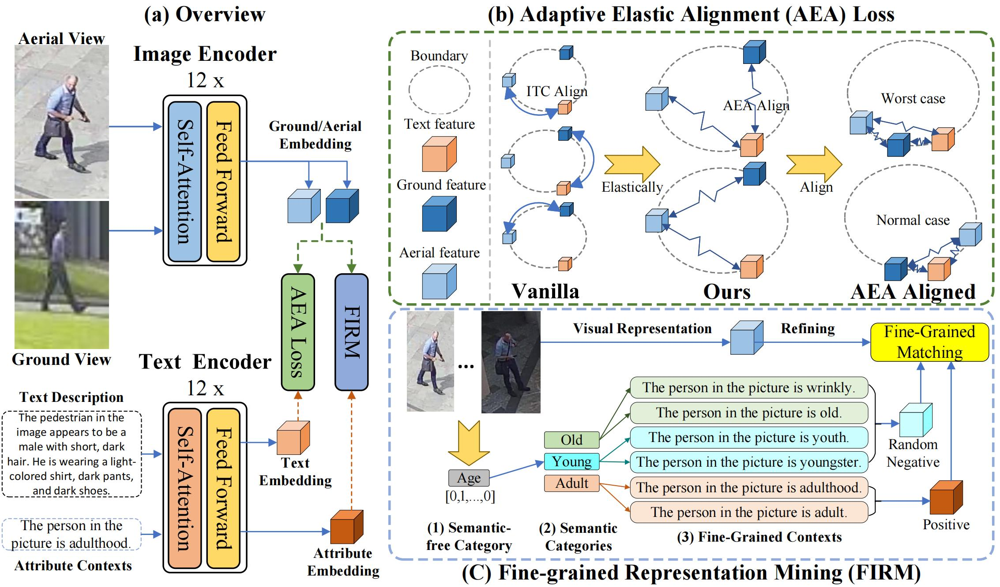
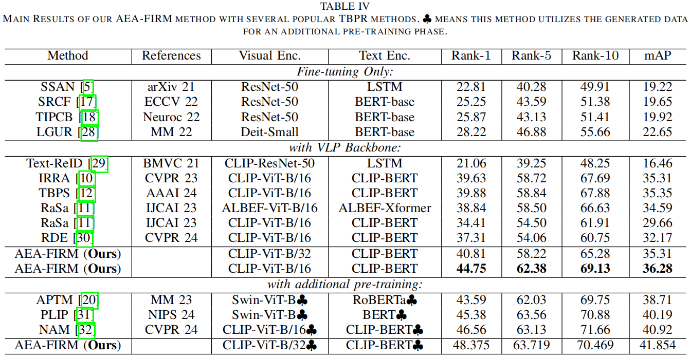

# AEA-FIRM-main
 Code and Dataset of paper "AEA-FIRM: Adaptive Elastic Alignment with Fine-Grained Representation Mining for Text-based Aerial-Ground Pedestrian Retrieval"

[](https://opensource.org/licenses/MIT)
[](https://www.python.org/)
[](https://pytorch.org/)

## 📌Highlight
- We propose a novel **T**ext-**B**ased **A**erial-**G**round **P**edestrian **R**etrieval (**TBAGPR**) task that introduces an aerial view in traditional TBPR tasks, broadening the scenarios of existing research.
- We propose a novel **A**daptive **E**lastic **A**lignment (**AEA**) loss for solving the cross-view gap.
- We propose a novel **FI**ne-grained **R**epresentation **M**ining (**FIRM**) method, refining the cross-modal semantic representation by mining and matching image features with textualized attributes.

## 🛠️Datasets
The images of our TBAGPR dataset are constructed based on two existing Aerial-to-Ground (A2G) image datasets: [AG-ReID](https://github.com/huynguyen792/AG-ReID) and [G2APS](https://github.com/yqc123456/HKD_for_person_search). We discard blurry images and maintain a balanced ratio of aerial and ground images by removing overflow aerial or ground images.

We use [ChatGLM](https://github.com/THUDM/ChatGLM2-6B) to generate the text description and filter out the low-quality sample by vanilla CLIP.

Our Dataset is available at [Baiduyun Disk](https://pan.baidu.com/s/11AEWNevciSjNMfqtxMPWIg?pwd=1x2x)(Code: 1x2x), [Google Drive](https://drive.google.com/file/d/1YYIpBDoJzTIwYRlpWUqEHmpo5GK05S_W/view?usp=drive_link) and [Quark Disk](https://pan.quark.cn/s/b3715d5d856a)(Code: KBfX)

## 📚Methods


## 🚀 Quick Start

Our code borrows partially from [IRRA](https://github.com/anosorae/IRRA). 

### Environment
```bash
conda create -n [env_name] python=3.10
conda activate [env_name]
pip install -r requirements.txt
```
### Prepare Datasets
Download the dataset from any of the above links and unzip it to `path_to_dataset\TBAGPR`.

### Training
we use single RTX3090 24G GPU for training and evaluation.

1. For Vanilla CLIP checkpoint.
```bash
CUDA_VISIBLE_DEVICES=7 python train.py --name irra --batch_size 64 --MLM --loss_names 'supkl+queue+match2+dot' --dataset_name 'AGDataAttr' --root_dir 'path_to_dataset\TBAGPR' --num_epoch 60
```

2. You can also use other pre-trained checkpoints (for example, [W. Tan, et. al., “Harnessing the power of mllms for transferable text-to-image person reid,” in CVPR, June 2024, pp. 17 127–17 137](https://github.com/WentaoTan/MLLM4Text-ReID)).

If you want to do this, please download the checkpoint to `path_to_model\checkpoint.pth`.
```bash
CUDA_VISIBLE_DEVICES=7 python train.py --name irra --batch_size 64 --MLM --loss_names 'supkl+qu
eue+match2+dot' --dataset_name 'AGDataAttr' --root_dir 'path_to_dataset\TBAGPR' --num_epoch 60 --finetune 'path_to_model\checkpoint.pth'
```

3. For evaluation
```bash
CUDA_VISIBLE_DEVICES=7 python test.py --config_file 'path_to_best_model/configs.yaml' --root_dir 'path_to_dataset\TBAGPR'
```

### 📊 Results



### 🙏 Acknowledgements
We sincerely appreciate for the contributions of [AG-ReID](https://github.com/huynguyen792/AG-ReID),  [G2APS](https://github.com/yqc123456/HKD_for_person_search), [IRRA](https://github.com/anosorae/IRRA) and [MLLM4Text-ReID](https://github.com/WentaoTan/MLLM4Text-ReID).


